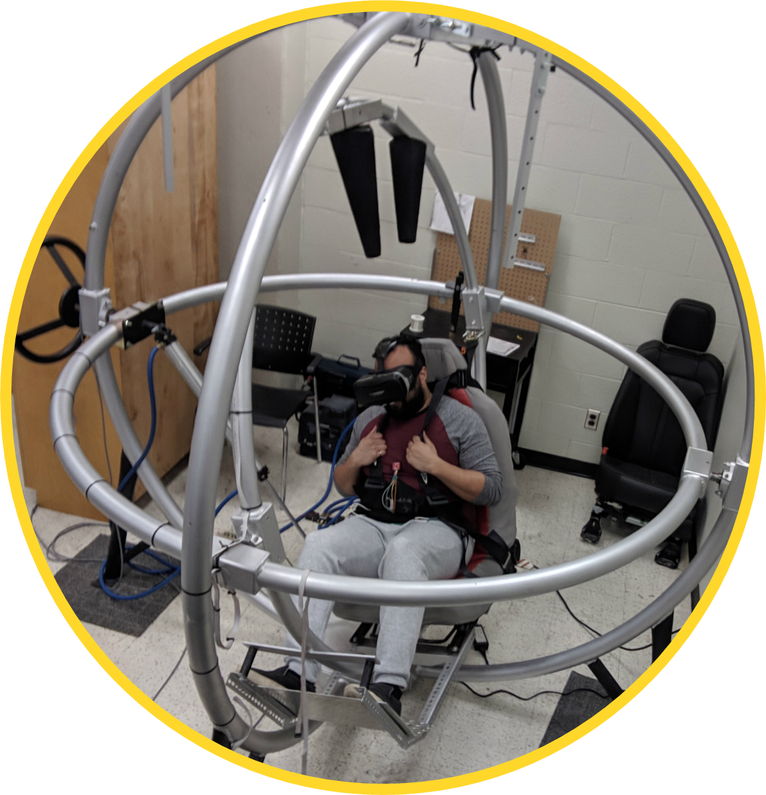

# Spaceball Aerotrim Device

Code for the Spaceball Microcontroller (ESP32) - To use with VIRTUAL REALITY TRUNK MUSCLE TRAINING SYSTEM Biomedical Capstone Project

## Purpose
The Spaceball is an apparatus that mimics a sphere where a person will be seated in a chair placed in the middle. The Spaceball moves in two degrees of freedom, pitch and roll. The pitch rotates such that the patient turns forward and backwards. The roll direction rotates the user side to side. Refer to the picture below of the apparatus in the appendix for a visual representation. In this design the Spaceball is to be used as the seated apparatus for the seated patient. The patient will use this for training the trunk muscles. The Spaceball will move in both the pitch and roll direction as the rehabilitation engineer or clinician decides when applying the training program. This will have the patient adjust to the movements and activate their trunk muscles in order to train and strengthen the muscles.

## Hardware

### Pnematic System

The primary source for the pneumatic control system will be provided by a Mastercraft air compressor. The air compressor will have two hoses connected to the air outlet using a T-splitter. Brass hose fittings will need to be purchased and inserted into the solenoids to allow for the hose connection. The hoses will connect to the fittings attached to the 12V in and out pneumatic solenoid air valves.  Two hoses will connect to two solenoid valves, to control the pitch degree of freedom. The valves will control air flowing into it for the movement of the left and right directions of the pitch degree of freedom. Two more hoses will connect to two more solenoid valves to control the roll degree of freedom. The valve will control the air flowing into it for the movement of the forward and backward directions of the roll degree of freedom. 
The Adafruit HUZZAH ESP32 Feather Microcontroller is used to control the pneumatic system to allow for the Spaceball to move automatically based on how the board is programmed. This is done from air passing through the hoses into the solenoid air valves. The air valves, when programmed by the board will allow the air to pass depending on how the user wants to manipulate the Spaceball.  The valve will open on one side to move the Spaceball left. When the other side of the valve opens and air passes through the Spaceball will move right. The same will happen for the forward and backward directions when air passes through the different sides of the second solenoid valve. The Spaceball also has a manual mechanism to rotate in both directions using a wheel located on the side of the Spaceball. The Microcontroller will move the Spaceball positioning based on both the accelerometer placed on the person and the Virtual Reality Biofeedback system. The initial position of the Spaceball will be determined by the accelerometer place on the user. The virtual reality biofeedback system will determine how the Spaceball moves next. 

### Control System

The circuit will use a 12V wall adapter for the power supply. The power supply is necessary to power the board and both solenoids. The power supply will connect to the Vin bus and the GND bus. A fly back diode rectifier is implemented in the circuit to stop large voltage spikes across the solenoid load. Next, a 5V voltage regulator is used to obtain an input of 5V power to the microcontroller safely thorough the USB port. The microcontroller will not be able to handle 12V of power without burning out. The FQP30N06L logic-level MOSFET transistors are used to increase the voltage from the board to power the solenoids. The MOSFET will switch the 3.3V output from the board to 12V to operate the solenoid. A logic level transistor must be used to fully turn on from the logic voltage of the microcontroller. Port 12 of the microcontroller connects to the G position of the MOSFET transistor. The Negative wire of the solenoid valve connects to the D position of the MOSFET. The S position of the MOSFET is connected to ground. These connections were repeated for three more solenoids using three different analog pins on the microcontroller. The ground port of the microcontroller will connect to the ground bus along with the negative arms of the capacitors. A 100nF capacitor and a 1uF capacitor allow the current to discharge at a slower rate as the solenoids would not be able to handle a quick change in current from just turning the circuit off directly, allowing each MOSFET to power the solenoids. A schematic diagram can be seen below including all the associated hardware.

## Software

The Firmware.INO file contains all the required software to obtain signals from the virtual reality software on the phone and trigger movements. The Microcontroller first sets up a connection and waits for a client to be connected to it. Once a client is connected, it will wait and read a message sent from the virtual reality software. There are 5 built in functions, defined in the software, one to control each direction of movement; Pitch up, Pitch down, Roll left, Roll right and Calibrate. The software will execture a function based on the message it recieves from the VR software and move the Spaceball accordingly
